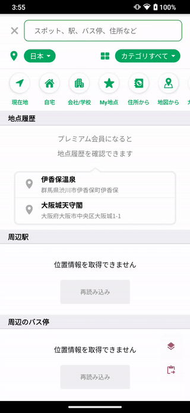
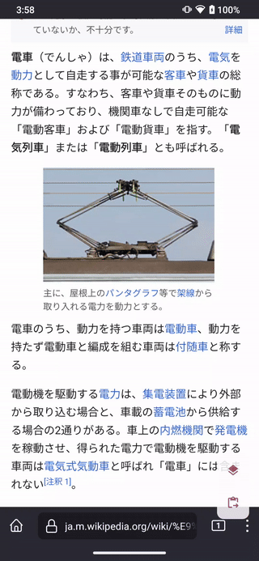
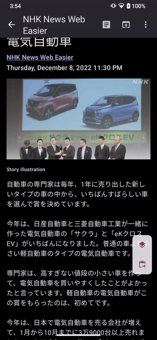
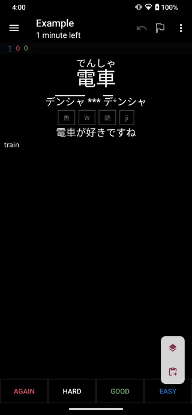

# Textbender

Bend Android text to your whim.

## Overview

Textbender is an Android app which lets you shuffle text from various sources to
various sources. In more concrete terms, it lets you do things like turn all
text on your screen into buttons you can press to open them in a dictionary like
[Yomichan](https://foosoft.net/projects/yomichan/) or
[Pleco](https://www.pleco.com/).

### Feature Overview

The most notable feature is the ability to retrieve any text on the screen
visible to the accessibility API.



You can also access text from other sources; another commonly used one might be
via the context menu.



Some apps don’t play nice with Android and only allow you to copy text.
Textbender has that covered:



You can also do things like integrate Textbender with your Anki notes to open a
word in Yomichan.



There’s more you can do that isn’t demonstrated in this list; for example,
instead of opening dictionary apps directly, you can have the overlay buttons
copy to the clipboard or send them to another app via the share menu.

## Usage Details

### Overlay and Clipboard

The text button overlay and clipboard are two features that require user
interaction to start.

#### Accessibility Shortcut

If you activate the accessibility shortcut, Textbender will open the button
overlay. This shortcut can take the form of a floating button or a gesture. See
the [official Android
documentation](https://support.google.com/accessibility/android/answer/7650693)
for more information.

#### Floating Buttons

You can configure Textbender to use a floating set of buttons, configurable to
show a button for the button overlay, clipboard, or both. Note that this is
different from the accessibility shortcut button described above.

#### Quick Settings Tiles

Textbender adds some [quick settings
tiles](https://support.google.com/android/answer/9083864) to activate the text
button overlay, bend the clipboard text, or toggle the floating buttons
described above.

#### Fingerprint gestures

Some devices (e.g. Google Pixel 5) have the ability to use gestures across the
fingerprint sensor as shortcuts. If you have a supported device, you can
configure Textbender to either open the button overlay or bend the clipboard
depending on which direction you swipe.

### Sources

#### URL scheme

Textbender accepts URLs with the format `textbender://x?x={text}`, where
`{text}` is the text to bend. You can edit your Anki card template to add a link
to your note. For example, to add a link to open a note field named
“Expression”…

``` html
<a href="textbender://x?x={{text:Expression}}">Open in Yomichan</a>
```

### Destinations

#### Open in URL

The URL format will replace any instances of the string `{text}` with the text
to be bent. For example, the URL format `https://duckduckgo.com/q={text}`, when
bent with the source text `foo`, will open the URL
`https://duckduckgo.com/q=foo`.

#### Yomichan

The yomichan integration is pretty flaky but works mostly reliable on my device.
It has the following requirements:

- Textbender’s accessibility service is enabled
- Kiwi Browser and the Yomichan extension are both installed
- Kiwi Browser is *open* with at least one tab.

## Development

The Textbender dev environment is provided as a Nix flake and is very easy to
build with [Nix](https://nixos.org/).

``` shell
nix develop
./gradlew installDebug
```

It’s really that simple. (Assuming you have Nix set up correctly.)
